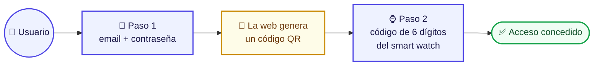
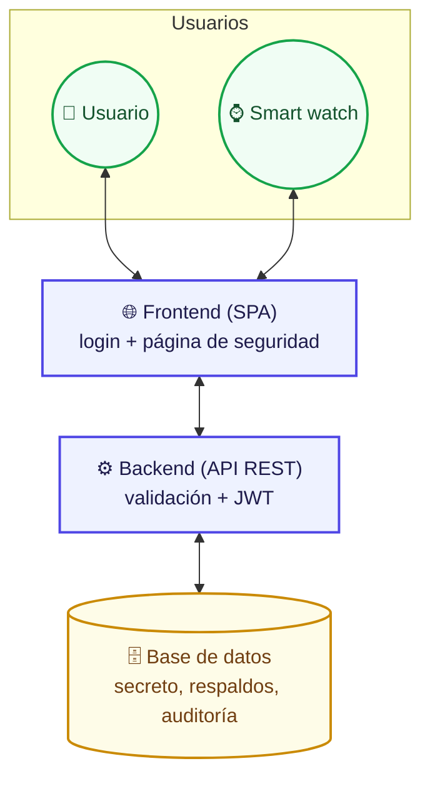
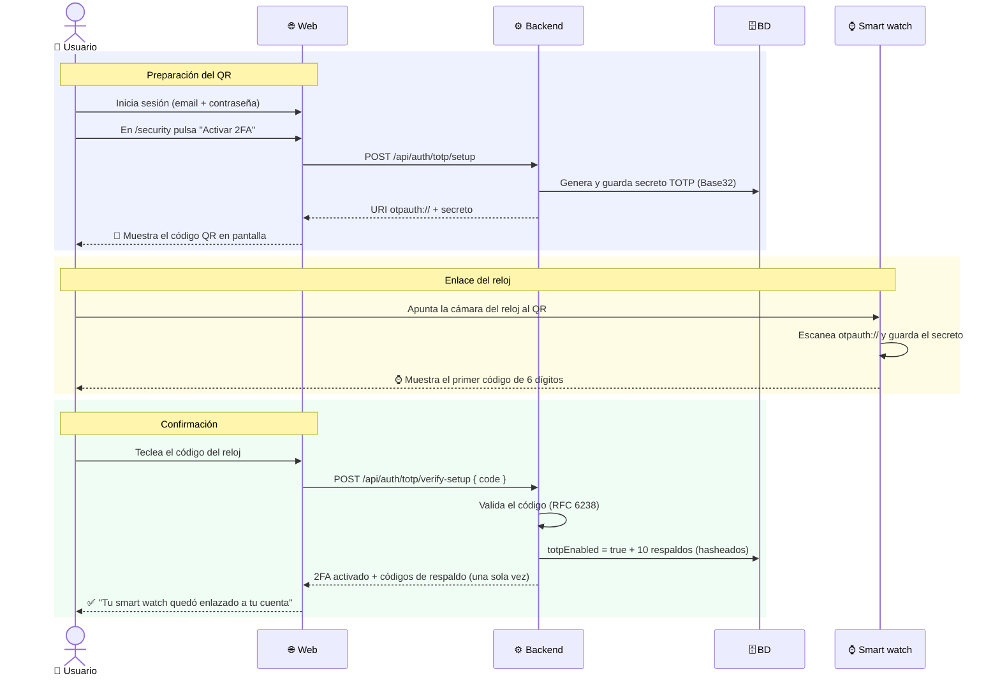
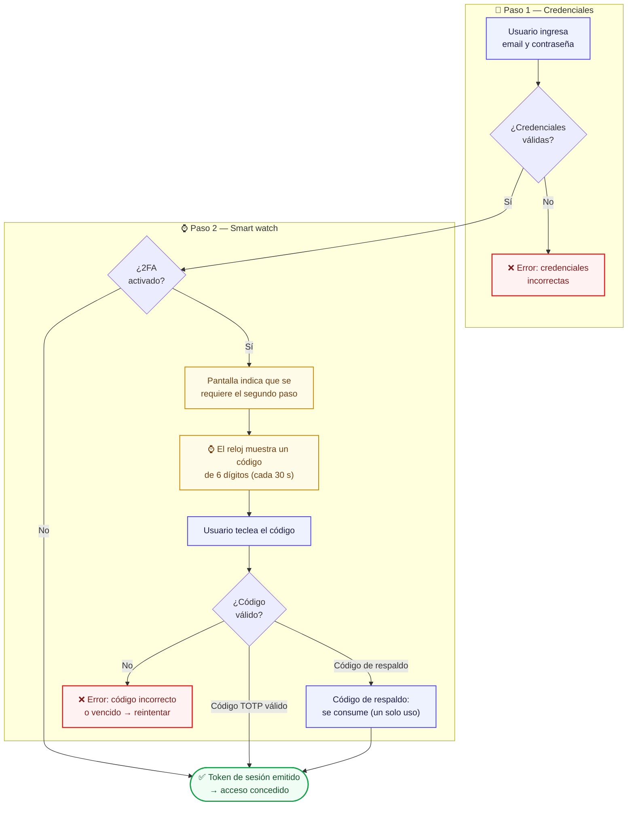
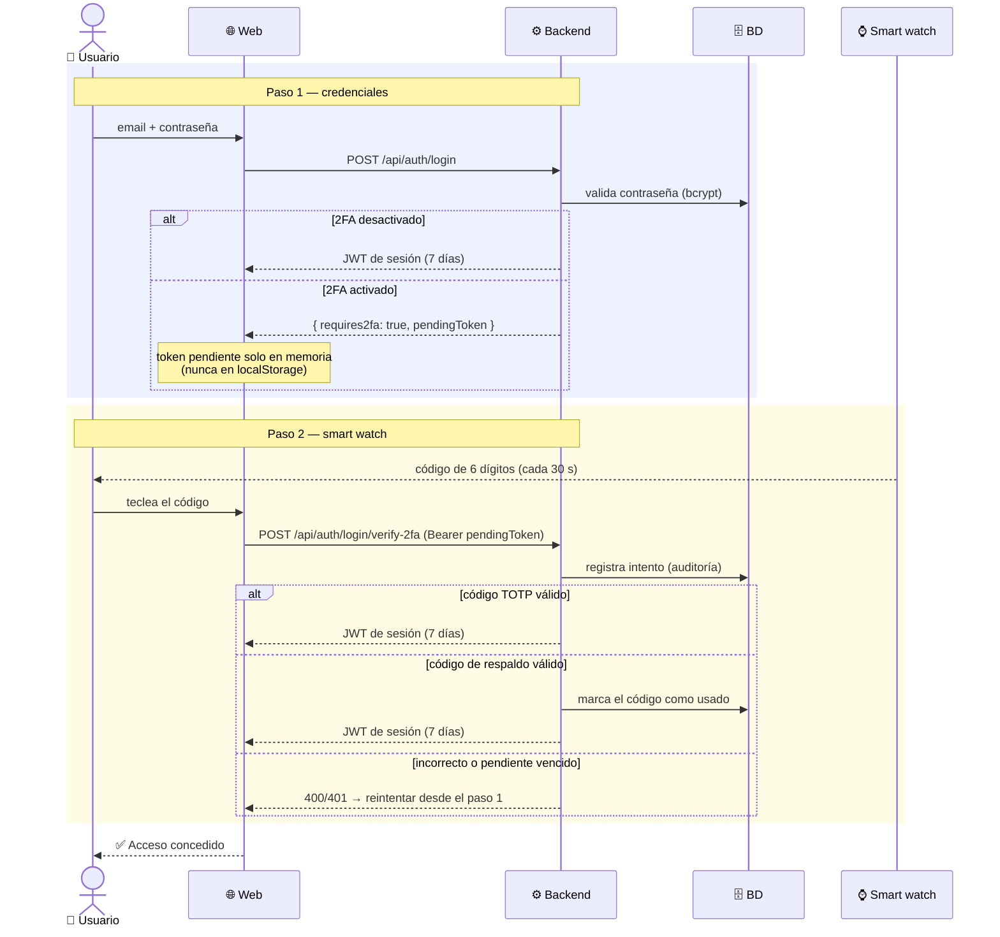
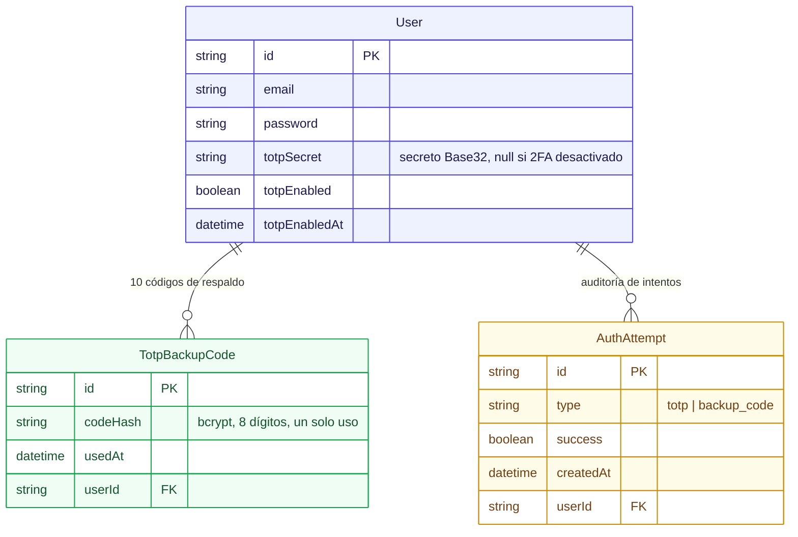
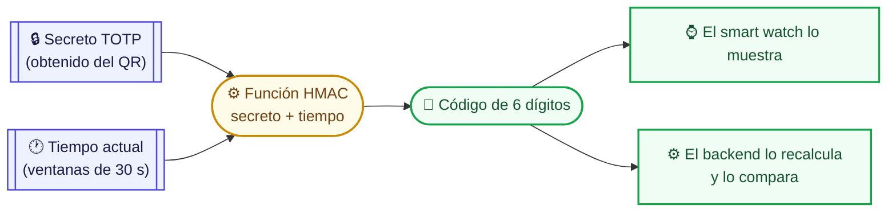
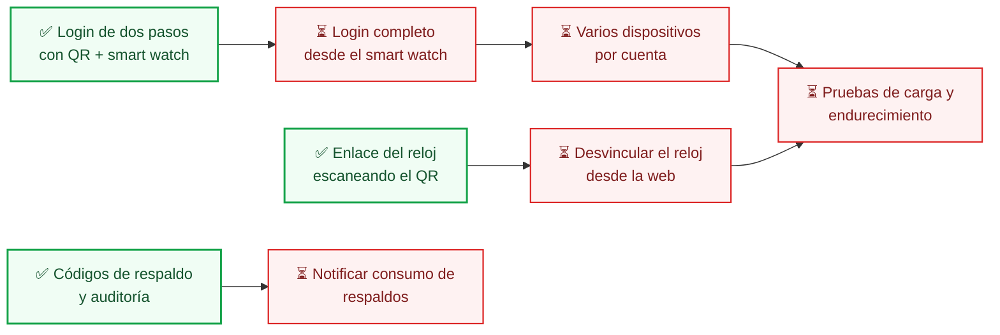

# Primer entregable — 8.º Cuatrimestre

## Sistema de autenticación en dos pasos (2FA) con QR y smart watch

**Proyecto:** Labandera — sitio de noticias con API REST
**Entregable:** Implementación de funciones del cuatrimestre: autenticación de dos pasos
**Estado:** versión en desarrollo (no definitivo; puede diferir del estado actual del repositorio)

---

## 1. Resumen

El ingreso a Labandera se divide en **dos pasos**:

Con este diseño, poseer la contraseña ya no es suficiente: el atacante además
necesitaría el **dispositivo físico** del usuario (el smart watch) para
completar el ingreso.

---

## 2. Componentes del sistema

| Componente | Rol en el sistema |
|---|---|
| **Backend (API REST)** | Valida credenciales, genera el secreto TOTP y el QR, verifica el código del segundo paso y emite el token de sesión (JWT). |
| **Frontend (SPA)** | Pantalla de login (dos pasos) y página de seguridad donde se muestra el QR y se confirma el enlace. |
| **Smart watch** | Escanea el QR, guarda el secreto TOTP localmente y genera el código de 6 dígitos cada 30 s. |
| **Base de datos** | Almacena el secreto TOTP del usuario, los códigos de respaldo (hasheados) y la auditoría de intentos. |

---

## 3. Método de enlace del smart watch a la cuenta

El smart watch **no se empareja por Bluetooth ni requiere instalación manual**:
se enlaza a la cuenta del usuario **escaneando el código QR** que la web
genera cuando el usuario activa el segundo factor.

El QR contiene una URI estándar `otpauth://` con el **secreto TOTP** del
usuario. Al escanearla, el reloj guarda ese secreto y a partir de ese momento
es "la app autenticadora" de esa cuenta.

### 3.1 Diagrama del proceso de enlace

### 3.2 Pasos del usuario (enlazado)

```mermaid
flowchart LR
    classDef paso fill:#eef2ff,stroke:#4f46e5,stroke-width:1.5px,color:#1e1b4b
    classDef fin fill:#f0fdf4,stroke:#16a34a,stroke-width:2px,color:#14532d

    A["1. Inicia sesión<br/>en la web"]:::paso
    B["2. /security →<br/>Activar 2FA"]:::paso
    C["3. La web muestra<br/>el QR"]:::paso
    D["4. El reloj escanea<br/>el QR"]:::paso
    E["5. El reloj muestra<br/>código de 6 dígitos"]:::paso
    F["6. Teclea el código<br/>en la web"]:::paso
    G["7. Backend valida<br/>y activa el 2FA"]:::paso
    H(["8. ⌚ Reloj enlazado<br/>a la cuenta"]):::fin

    A --> B --> C --> D --> E --> F --> G --> H
```

> **Nota de diseño (estado actual):** el enlace se realiza escaneando el QR
> desde el navegador web. En una versión posterior se contempla que el propio
> smart watch haga la autenticación de la cuenta (login completo en el reloj)
> para que el usuario no necesite teclear nada.

---

## 4. Flujo de inicio de sesión en dos pasos

### 4.1 Diagrama de flujo

### 4.2 Secuencia completa del login

---

## 5. Modelo de datos (segundo factor)

| Entidad | Propósito |
|---|---|
| `User.totpSecret` | Secreto con el que el smart watch y el backend calculan el mismo código TOTP. |
| `TotpBackupCode` | 10 códigos de respaldo (8 dígitos) para recuperar el acceso si se pierde el reloj. Se almacenan **hasheados** y son **de un solo uso**. |
| `AuthAttempt` | Registro de auditoría de cada intento del segundo paso (éxito o fallo). |

---

## 6. Cómo funciona el código TOTP (concepto)

El código de 6 dígitos **no se envía por ningún canal**: se calcula de forma
independente en el smart watch y en el backend a partir de:

- el **secreto** compartido (el que el reloj obtuvo del QR), y
- el **tiempo actual**, redondeado a ventanas de 30 segundos.

Mismo secreto + mismo instante → mismo código. El backend acepta códigos de
la ventana actual y las dos adyacentes (±30 s) para tolerar pequeñas
desincronizaciones entre el reloj y el servidor.

---

## 7. Decisiones de seguridad del entregable

| Decisión | Por qué |
|---|---|
| 🔹 **Token pendiente efímero** | Tras el paso 1, el token de ~5 min vive **solo en memoria** del frontend; nunca en `localStorage` ni cookies. |
| 🔹 **Códigos de respaldo seguros** | Almacenados hasheados (bcrypt) y de **un solo uso**. |
| 🔹 **Rate limiting** | El endpoint del segundo paso tiene un límite estricto de intentos por IP contra fuerza bruta. |
| 🔹 **Auditoría** | Cada intento del segundo paso queda registrado (`AuthAttempt`). |
| 🔹 **Desactivación protegida** | Apagar el 2FA requiere volver a ingresar la contraseña, no basta con el token. |

---

## 8. Estado actual y pendientes (no definitivo)

El sistema **funciona** pero no es la versión final del cuatrimestre.

---

## 9. Referencias

- RFC 6238 — *TOTP: Time-based One-Time Password Algorithm*.
- RFC 4226 — *HOTP: HMAC-Based One-Time Password Algorithm*.
- Especificación `otpauth://` — formato estándar de las URI que contienen el
  secreto TOTP dentro del QR.
- Documentación interna del repositorio: `docs/2fa.md`, `docs/mer-2fa.mmd`,
  `docs/mer-auth.mmd`, `wear-app/README.md`.
